***
# Análisis de un modelo de red simple con nodo emisor y receptor
**Autores:** Nahuel Fernandez, Ignacio Gomez, Luciano Rojo.

Link a la presentacion: https://drive.google.com/file/d/1i_8QDvMWSVq3cCjofcMVsBh_HHVmWhY-/view?usp=sharing

### Abstract

Durante este Informe, analizaremos un modelo red basado en 2 nodos, un nodo emisor `nodeTx` y un nodo receptor `nodeRx`, conectados entre si por un buffer `Queue`, comenzando desde un simple analisis que no contempla nociones de capacidad, como la velocidad de transferencia de datos y la memoria de `nodeTx` y `nodeRx`, luego se analizara una implementación que si contempla estas nociones y se mostrara la implementación llevada a cabo para solucionar los problemas subyacentes.

***

### Introducción

Empezaremos analizando el siguiente modelo:

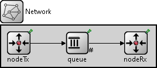

El modulo `nodeTx` internamente se compone de un generador `gen`, y un buffer `Queue` que recibe los `pkt` del emisor y los almacena para luego ser enviados al `nodeRx`

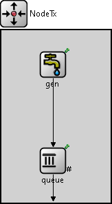

El módulo `nodeRx` internamente se compone de un buffer `Queue` que recibe los paquetes y los envia al receptor`sink`, que representa a la capa de aplicación.

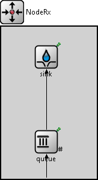

La conexion de `nodeTx` a `nodeRx` no es directa, hay un buffer intermediario `Queue`,  que se podria pensar de alguna manera como un enrutador, ya que recibe `pkt` y los reenvia a un destinatario. Como ya se dijo, este enrutador intermedio cuenta con un buffer, cuya capacidad es de 200 paquetes.

Con todo esto en cuenta, consideremos 2 casos en los que pondremos a prueba este modelo, variando las velocidades de transmisión de cada una de las partes y consiguiendo así distintos comportamientos en cada nodo.

#### Caso 1:
- `nodeTx` a `Queue`: datarate 1Mbps y delay = 100us
- `Queue` a `nodeRx`: datarate 1Mbps y delay = 100us
-  Capacidad de los buferes de 200 paquetes.

 internamente en nodeRx...
- `Queue` a `Sink`  : datarate = 0.5Mbps 

#### Caso 2:
- `nodeTx` a `Queue`: datarate 1Mbps y delay = 100us
- `Queue` a `nodeRx`: datarate 0.5Mbps y delay = 100us
-  Capacidad de los buferes de 200 paquetes.

internamente en nodeRx...
- `Queue` a `Sink`  : datarate = 1Mbps 

En ambos casos, vamos a estar enviando paquetes de 12500Bytes, los cuales seran generados con intervalos de tiempo en base a una distribución exponencial (por lo general con media de 100ms).
Como se dijo, los buffers seran limitados en capacidad de paquetes, usaremos una configuracion que admite hasta 200 paquetes, a excepción del buffer de `nodeTx` en el que se tendrá una capacidad arbitrariamente alta (se asume infinita). A su vez, establecemos métricas de tiempo de servicio de los paquetes, paquetes "Soltados" o perdidos, paquetes enviados, espacio restante en los bufferes, etc.

En este proceso intervendrán las siguientes variables:

`Intervalo de generación de paquetes:` se corresponde con la tasa a la que el generador genera nuevos paquetes y los entrega al nodo emisor. Esta variable jamás se ve modificada y puede asumirse como una constante en el contexto de nuestra simulación, ya que su comportamiento depende de la capa anterior y no nos corresponde manipularlo.

`Tamaño de los bufferes:` se corresponde a la capacidad que tienen los búferes para almacenar paquetes de forma temporal. Notar que esta variable solo afecta a los búferes que no se encuentran en el emisor, ya que como se dijo, este se asume infinito.

`Tamaño de los paquetes:` representa el tamaño en bytes que tendrá cada paquete generado en el nodo emisor. A lo largo de todo el desarrollo se asume un valor de 12500 bytes.

`sim-time-limit:` cantidad de tiempo durante la cual se ejecuta la simulación.

Durante la simulación se registran y miden los siguientes cambios de estado:
-   Cantidad de paquetes en cada buffer a lo largo de la simulación.
-   Cantidad de paquetes perdidos.
-   Carga útil
-   Generación y utilización.

En `omnetpp.ini` podremos observar las variables del siguiente modo:

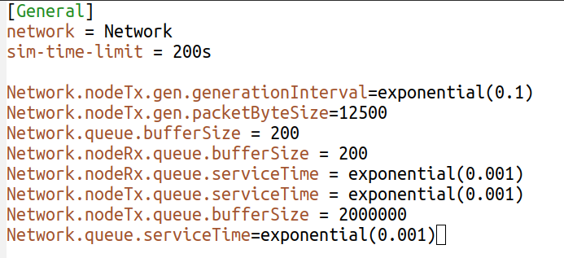

Ahora, una muestra de como se ve la ejecución en Omnet:

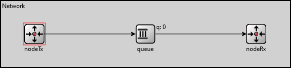

## Gráficas iniciales

Al correr y estudiar la simulación de la network, observamos ciertos detalles que nos parecieron importantes mostrar. A continuación se presentan los gráficos de las mediciones hechas.

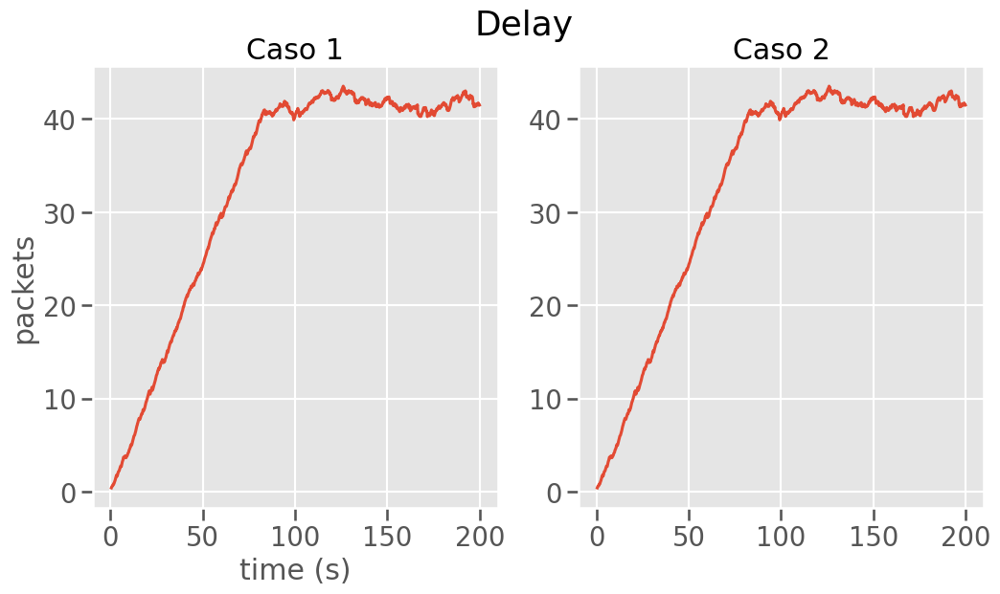

El delay en ambos casos es similar, crece linealmente hasta que en cierto punto se mantiene en un máximo.

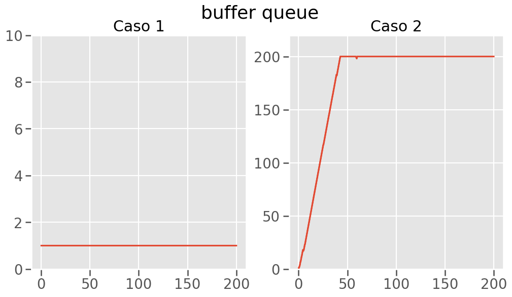
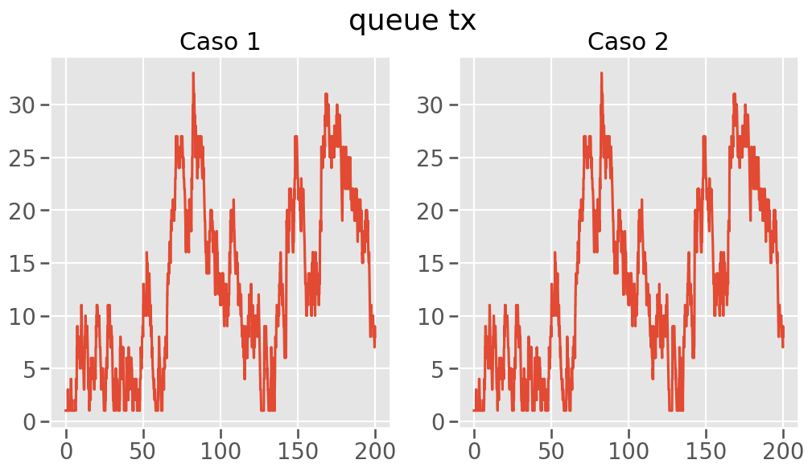
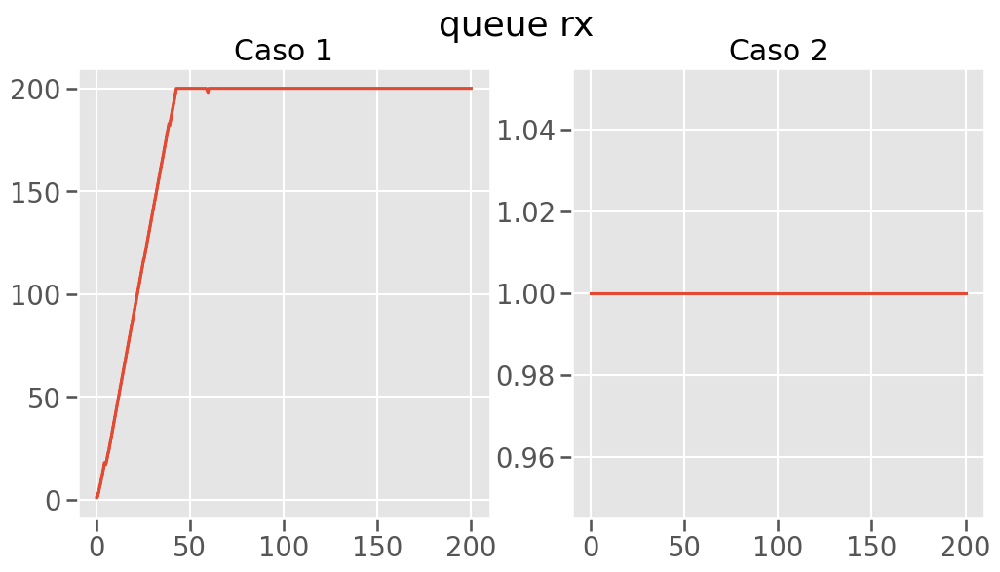

En las colas, podemos observar un diferencia en el comportamiento. Para el caso 1, los paquetes se van acumulando en la cola de rx. Mientras que en el caso 2, los paquetes se acumulan en la cola intermedia. Los cambios de velocidad entre los casos son los causantes de estas variaciones. En uno primero los paquetes fluyen, pero se atascan. Mientras que en el otro, los paquetes se atascan en la cola del medio, pero hacia el final pueden fluir bien.

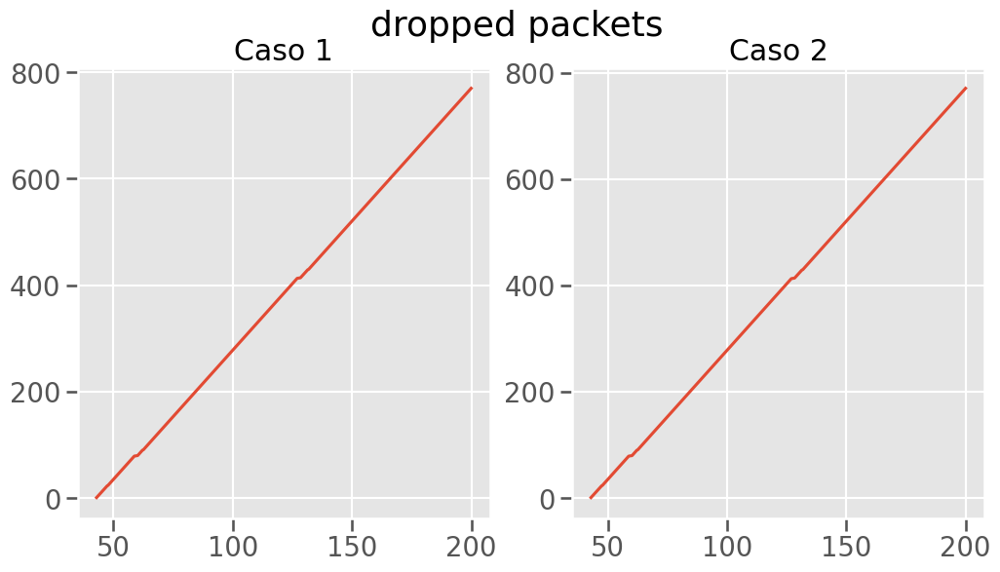

Se pierde la misma cantidad de paquetes en el caso 1 como en el caso 2. Esto es inferible antes de realizar la simulación, ya que simplemente trasladamos el cuello de botella de una queue a otra con los mismos parámetros.
***
Una pequeña conclusión que podemos sacar de esta network en base a las métricas obtenidas es que ambas tienen problemas de congestión de paquetes, solo que en distintos lugares según el caso. También observamos una buena cantidad de pérdida de paquetes en ambos casos, ya que por cómo están dispuestos los valores, se llega a una congestión luego de cierto tiempo. 
***

### Métodos

#### Modificación a la network.

Antes de iniciar el desarrollo del algoritmo, se precisó realizar una modificación importante a la red, que fue la adición de un nuevo canal de retroalimentación regulado con su propio buffer, y una modificación a la interfaz que consistió en la creación de los paquetes de feedback. Este canal nos permite enviar paquetes de feedback desde el receptor al emisor para indicar el estado de diversas variables referidas al comportamiento de la red en un momento dado. Este canal nuevo es solo usado para el propósito mencionado anteriormente.

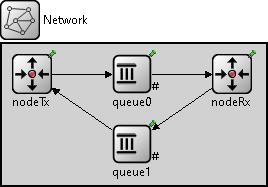

#### Descripción del algoritmo propuesto.

Nuestro algoritmo puede verse como una implementación del esquema "Parada y espera". Su funcionamiento es simple (comparado con otras aproximaciones como Reno o Tahoe), y nos permite medir de forma intuitiva su performance.
A grandes rasgos, podemos predecir su comportamiento al entender la forma y la medida en la que serán utilizados los canales para transmitir una cierta cantidad de carga útil.
Sabemos por la naturaleza de este algoritmo, que llegado un cierto punto, el canal será utilizado en un 50% para enviar información y otro 50% para transmitir feedback (confirmaciones de recepción). Si bien esta aproximación al problema del control de flujo y congestión no es la más eficiente en términos de utilización del canal, nos permite observar diferencias sustanciales ante un escenario similar pero sin un algoritmo que ataque esta problemática.

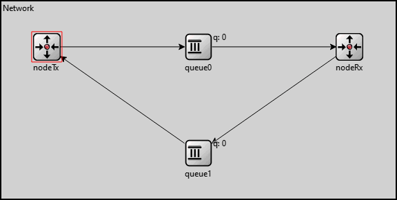

Entrando en detalles de la implementación, no se necesitan demasiadas modificaciones para lograr este cometido.
Para llevarlo a cabo, disponemos de una variable booleana que es manipulada dentro del nodo Tx, ya que es el emisor quien deberá interpretar la presencia o ausencia de un paquete de feedback en el retorno de Rx.
Si se recibe un paquete de feedback, esta variable será seteada a true, permitiendo a Tx enviar el siguiente paquete, de lo contrario, no podrá enviar el siguiente paquete hasta que llegue el feedback correspondiente al anterior.

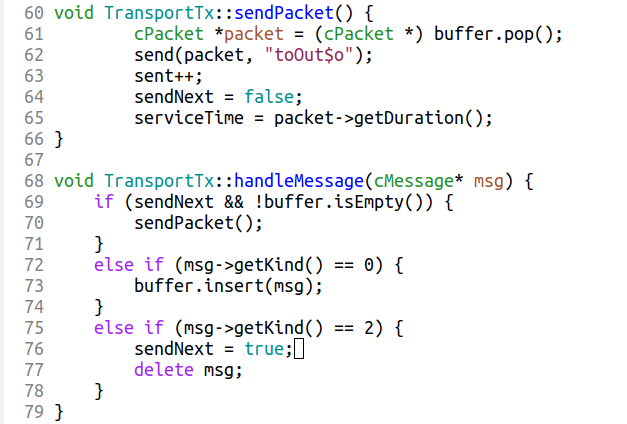
***

### Resultados

Una vez lograda la implementación del algorítmo, hemos tomado nuevas mediciones. A continuación, los gráficos de la sección post-diseño, usando los mismos parámetros mostrados anteriormente.

#### Delay:
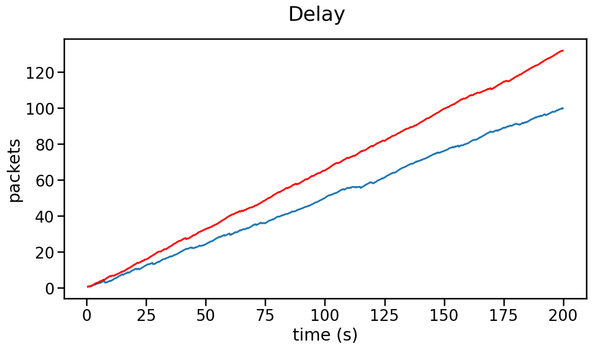

Observación: tenemos un delay lineal, que tiene que ver con la suma de los retrasos por los mensajes 'ack' del feedback.

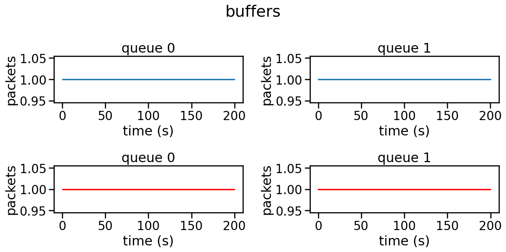

Observacion: en cambos casos, tanto q0 como q1 no se llenan nunca, esto es porque solo almacenan 1 paquete a la vez, aunque estos buffers tengan capacidad de almacenar hasta 200 paquetes

##### Carga util:
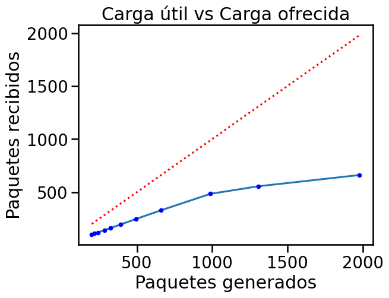

Podemos observar que a medida que generamos mas paquetes en una simulación, la carga útil disminuye poco.
Esto se debe a que la velocidad con la que se generan paquetes dentro de `nodeTx` es superior al tiempo que hay entre que se envia un paquete y otro a `nodeRx`

#### Problema en una medición

Al querer medir nuevamente los paquetes desechados (dropped packets), nos encontramos con la sorpresa de que el vector no se guarda por mas que el código en Queue.cc sea el mismo que en la implementación original.

De todos modos, observando la red, podemos ver que no hay o bien hay muy pocos paquetes que se descarten.
Esta métrica es muy importante, ya que en algún escenario posible, uno querría que no se pierdan paquetes en el medio del camino. De todas formas, se puede inferir la cantidad de paquetes descartados con las métricas actuales, ya que la cantidad de estos es el resultado de la diferencia entre la carga ofrecida y la útil.

***

### Discusión

Concluímos este proyecto habiendo obtenido un conocimiento más profundo y didáctico sobre el funcionamiento de una conexión de red básica en un esquema productor-consumidor. Construimos una implementación visual y funcional de algo que hasta ahora solo se veía desde la teoría, e implementamos uno de los algoritmos de control vistos en clase.
De poder permitirnos el tiempo, podríamos implementar mejoras como añadir un esquema de arranque lento y usarlo en combinación con el sistema de parada y espera para incrementar exponencialmente la cantidad de paquetes enviados en la misma unidad de tiempo, manteniendo esta dependencia de Tx respecto al feedback de Rx.
Una parte considerable del tiempo brindado por la cátedra fue utilizado para instalar el entorno de omnet y aprender a usarlo, teniendo cada miembro del grupo problemas y sistemas diferentes. 
Luego, una gran dificultad en la parte de diseño fue fue el desconocimiento de la herramienta Omnet, por lo que algo sencillo como hacer un algoritmo parada y espera, nos llevó muchísimo mas tiempo del deseado. En un principio pensabamos hacer un algoritmo "mejorado" del parada y espera, que tenga en cuenta la capacidad del buffer y con mensajes de feedback con mayor información, pero al tener fallos o comportamientos inesperados sin saber de donde vienen en las cosas que escribíamos, decidimos que era mejor implementar un algoritmo mas simple. 

#### Ventajas y desventajas del diseño

La solución ofrecida tiene menor carga útil, pero se pierden menos paquetes(casi ninguno en lo observado), por lo que en una corrida donde el generador dejase de generar, y hubiese el tiempo suficiente, llegarían correctamente todos los paquetes.

Una desventaja importante es el tiempo en que tardan los paquetes en ir desde el productor al consumidor. Los paquetes tienen que estar esperando en un buffer del productor hasta que le llegue un paquete de feedback, recién ahí se podrá un nuevo paquete. Ésta espera se alarga cada vez mas ya que los paquetes se van amontonando en el buffer. En una implementación realista, este esquema dejaría mucha capacidad de uso del medio sin aprovechar.
Para tener un desempeño óptimo, el buffer tiene que ser muy grande(infinito), o el intervalo de generación de paquetes debe ser igual o más lento que el tiempo promedio de retorno de los ACKs, ya que de otra manera habría una pérdida de paquetes bastante grande en el buffer de nodeTx por las esperas acumuladas con el pasar del tiempo.

***

### Referencias

- Andrew S. Tanenbaum and David J. Wetherhall. Computer Networks (5th Edition). Prentice Hall, 2011.
- Kurose, J. F. and Ross, K. W. Computer Networking – A Top Down Approach. Seventh Edition, Pearson, 2017.
- Filminas y videos brindados por la cátedra.

***

## Anexo: uso de inteligencia artificial

Para la realización de este laboratorio hemos usado dos herramientas de inteligencia artificial: ChatGPT y Copilot. A continuación enumeraremos algunos usos en cada una de ellas.

### GitHub Copilot
Se utilizó la extensión de Visual Studio para autocompletar varios elementos predecibles del código, así como para crear esqueletos de funciones que siguen esquemas comunes o que ya habíamos hecho en otros lugares del programa.
Al final se lo utilizó para tratar de obtener información acerca del funcionamiento general de los nodos, sobre como visualizar datos de forma gráfica en OMNet (antes de ver el video de Matías) y de la ausencia del vector de paquetes perdidos, brindando información útil en todos los casos salvo en este último, ya que aunque se le brindó información sobre el código, Copilot repetía funciones que ya estaban implementadas.

### Microsoft Copilot
Esta versión de copilot se usó para investigar sobre posibles aproximaciones ya existentes al problema del control de flujo y congestión para tratar de adoptar ideas de diferentes algoritmos.
También se la utilizó para brindar asesoramiento sobre casos de errores varios en OMNet, que generalmente eran muy poco descriptivos.

### ChatGPT
Fue utilizado para  hacer preguntas de diversa índole. A continuación algunos ejemplos:

#### Consulta sobre la libería gráfica matplotlib

Queríamos saber como dibujar un gráfico al lado del otro, como escalar gráficas. **Resultado**: satisfactorio, creemos que son preguntas que se han hecho muchas veces, el output que nos dió fue aceptado sin mayor preocupación.

#### Errores de código en la ejecución de omnet

Al intentar implementar un algoritmo de diseño (no el presentado) tuvimos error en la función scheduleAt(). Le hemos dado diferentes preguntas, le mostramos parte del código para ver si podíamos ir ajustando el problema, pero este problema no tuvo ninguna solución satisfactoria. **Resultado:** no satisfactorio.

#### Funcionamiento de git
En un momento se quiso comparar cambios entre la rama local y la remota. Sabíamos que era con git diff pero no que parámetros tomar. **Resultado:** respondido con éxito, el output fue usado ya que era lo lógico, nos sugirió usar el comando`git diff HEAD origin/master`. 

