***
**Redes y Sistemas Distribuídos 2024**

**Autores:** Nahuel Fernandez, Ignacio Gomez, Luciano Rojo.

**Link a la presentacion:** https://drive.google.com/file/d/1zKgkyMxP7Ig5Zy6c9f3HRwKepM4mkL8Y/view?usp=drive_link


># Diseño de algoritmo de enrutamiento en red de tipo anillo 

# Abstract

En este informe nos adentraremos en el análisis de un enrutamiento dado en una red de tipo anillo. Luego propondremos un algoritmo para mejorar el enrutamiento. Para las simulaciones de redes utilizaremos el software Omnet++.

# Introducción

Una red en anillo es una topología de red en la que cada nodo se conecta exactamente a otros dos nodos, formando una única ruta continua(un ciclo). Para este trabajo en particular, tendremos 8 nodos, cada uno con dos interfaces de comunicación *full-duplex* (el canal puede transmitir información en ambos sentidos al mismo tiempo) con dos posibles vecinos.
En Omnet++ la red se ve de la siguiente forma:

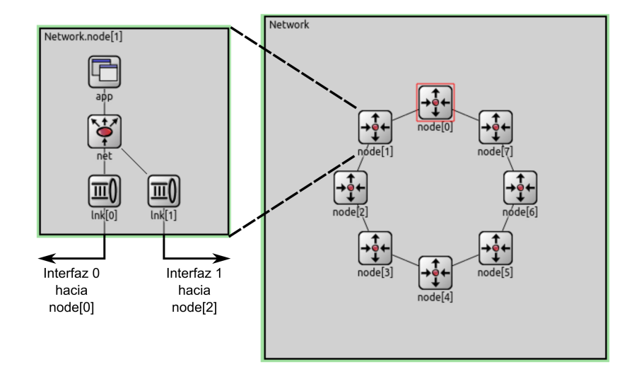


# Parte 1: Análisis
Esta parte se divide en dos casos de testeo, que difieren en la cantidad de nodos que generarán tráfico hacia el nodo 5.
Para ambos casos la **generación de paquetes** será en base a la distribución exponencial con $\lambda = 1$ y el **tamaño de los paquetes** será de 12500 Bytes.
Luego, al correr los casos obtendremos y compararemos las métricas: **paquetes generados, tamaños de buffer, paquetes entregados, delay y paquetes perdidos.**
El algoritmo de enrutamiento usado (dado por la cátedra) funciona de la siguiente manera: si un mensaje llega a nodo destino, se envía a App. De otro modo se envía al nodo conectado en sentido horario.

## CASO 1:

Se ejecuta el modelo con las fuentes de tráfico configuradas como node[0] y node [2] transmitiendo datos a node[5]. Recordemos que node[0] y node[2] ambos envían paquetes en sentido horario en el anillo.
Una vez completada la simulación, obtenemos instancias de las métricas anteriormente mencionadas.

El siguiente gráfico muestra la función de generación de paquetes de ambos nodos.

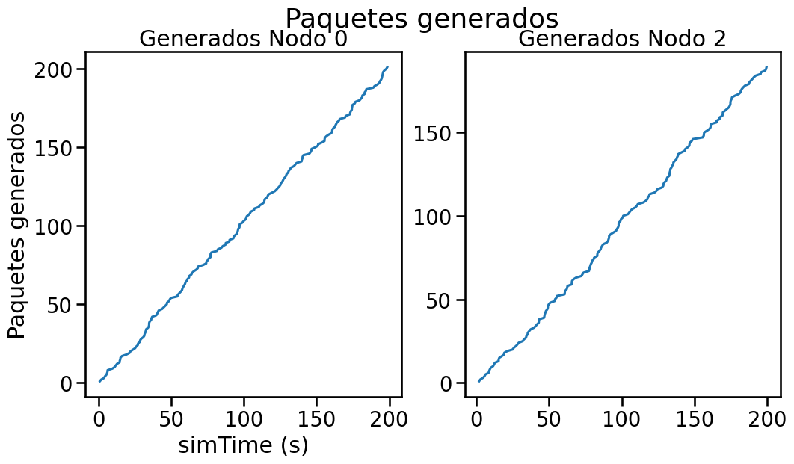

La función de retardo de envío de paquetes por parte del nodo 5 es como se ve a continuación:

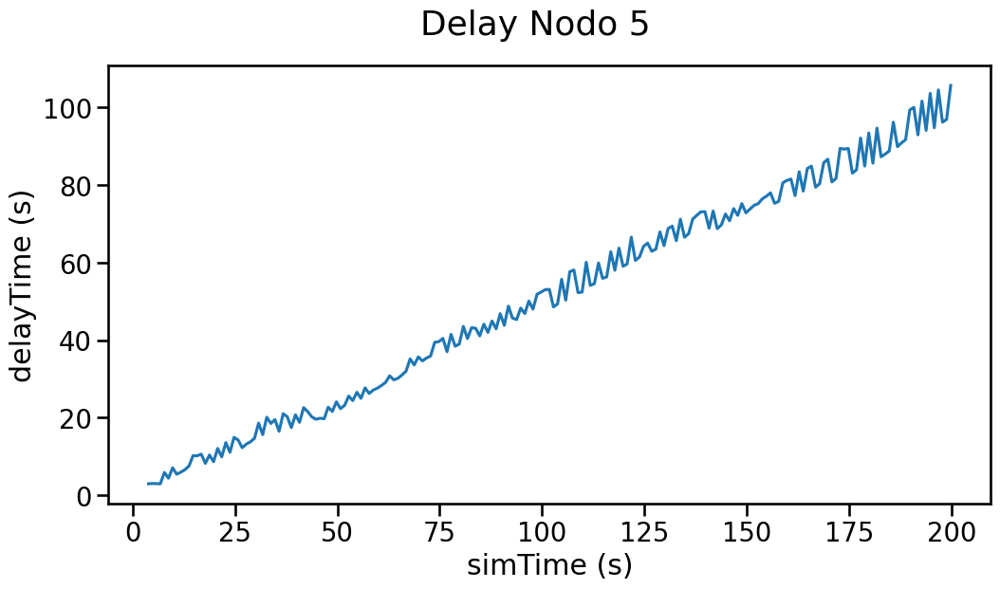

El siguiente gráfico muestra la cantidad de paquetes que el nodo 5 envía a la capa de aplicación.

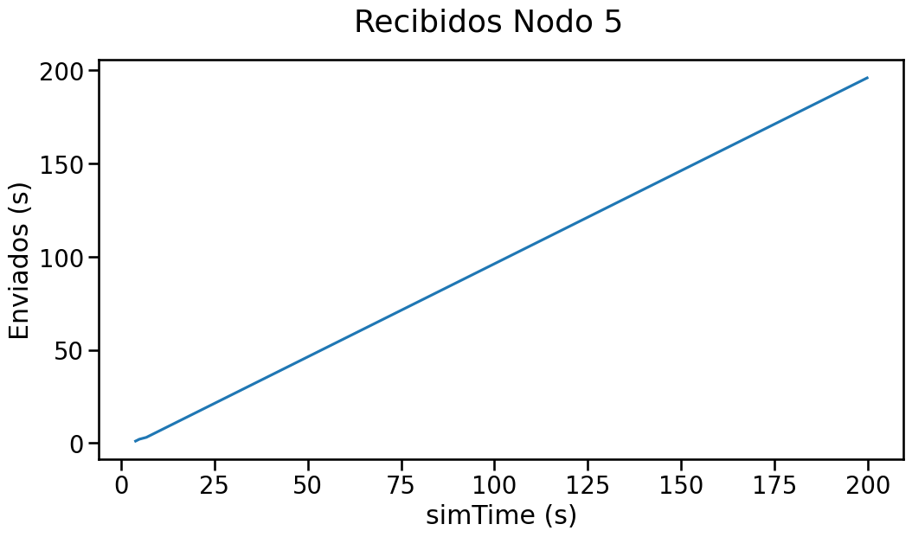


Luego de analizar los gráficos, podemos notar que se produce una congestión de aproximadamente el 50%, ya que tanto node[0] como node[2] están generando alrededor de 200 paquetes cada uno, y node[5] solo envió 200 hacia App, dejando una pérdida de aprox. 200 paquetes.
La demora (delay) desde que un paquete es generado hasta que es enviado presenta una curva casi lineal con irregularidades generadas por el distinto tiempo que le insume a cada paquete ser enviado según la congestion presente.
La congestión es principalmente producida por una sobrepoblación de paquetes en el búffer del node[0] que no pueden avanzar a node[1] porque el enlace está saturado.

**CASO 2:** 
Para este caso, los nodos generadores serán todos, excepto node[5], los cuales transmiten datos a node[5]. Todos los nodos generadores transmiten los paquetes en sentido horario hasta node[5], lo que inevitablemente producirá una mayor demora en el envío de los paquetes mientras mas larga sea la distancia en sentido horario.
Una vez completada la simulación, obtenemos instancias de las métricas anteriormente mencionadas.


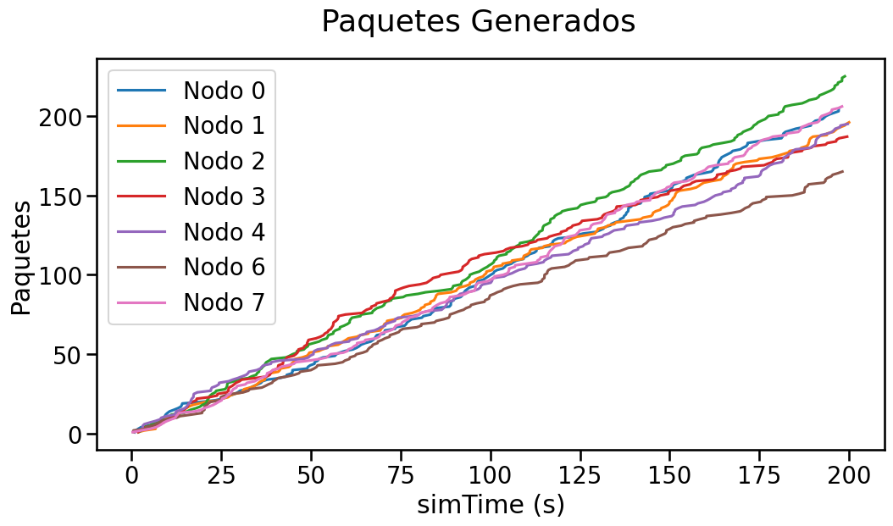


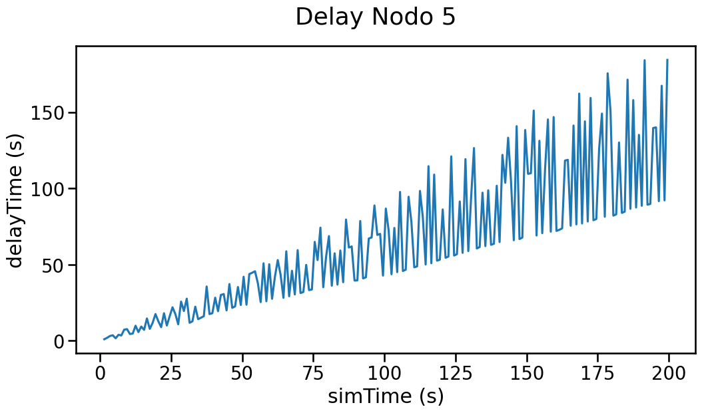


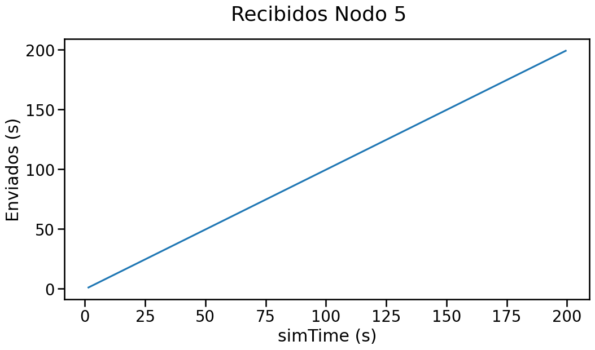


Tenemos que ahora hay 7 nodos generando, en promedio, 170 paquetes cada uno. Todos estos paquetes circulan por el anillo en sentido horario hasta node[5] donde son enviados a la capa de aplicación.
En esta última etapa, notamos que la cantidad enviada sigue siendo la máxima que puede manejar node[5], que es de 200 paquetes. Vemos que la pérdida de paquetes se ha incrementado notablemente y alcanza un valor aproximado del 83%.

Otra métrica que resalta a la vista es el delay, que ahora presenta una amplitud bastante errática.
Esto último se dá debido a la llegada intercalada de paquetes generados en los nodos 0, 6 y 7 con aquellos generados en los nodos 1, 2, 3 y 4. Esta llegada intercalada produce que se registren delays que difieren mucho entre si, ya que los del primer grupo llegan considerablemente antes que los generados por el segundo, que deben atravesar todo el anillo para llegar a node[5]. El siguiente gráfico resume esto, donde podemos ver a los nodos  ordenados según la distancia en sentido horario respecto al nodo 5.

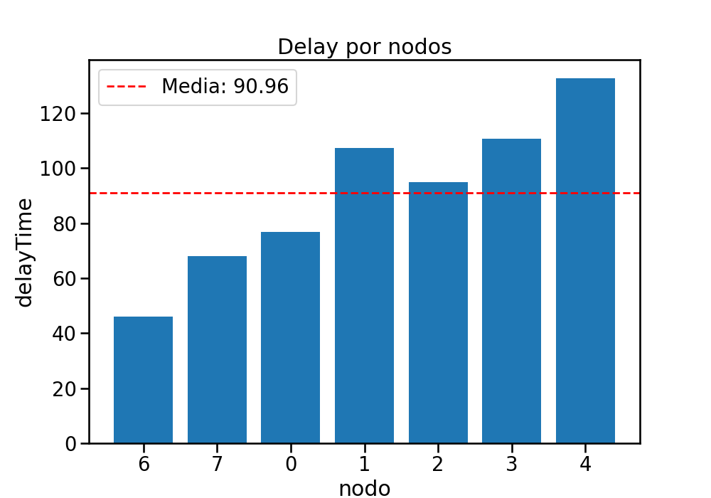

### Estabilidad en la red

En el caso 2(también en caso 1) la generación de paquetes en los nodos productores está dado por  el parámetro `interArrivalTime` en `omnetpp.ini`. Si quisieramos minimizar la pérdida de paquetes, podríamos aumentar el intervalo de generación de paquetes (por lo tanto menos paquetes generados), y buscar el valor tal que la pérdida de paquetes cae dentro de un margen razonable al que llamaremos "umbral de estabilidad", donde definimos "estabilidad" como la ausencia o ínfima presencia de paquetes perdidos en los resultados.

En la simulación, la media de generación es de 1:

`Network.node[{generadores}].app.interArrivalTime = exponential(x)`

Esta linea configura a los nodos del conjunto "Generadores" para que simulen la llegada de paquetes cada un intervalo de tiempo promedio determinado por la distribución exponencial de parámetro x a la cual está asignada.
Como la capacidad de envío de node[5] no cambia, la única forma que tenemos hasta ahora de reducir la pérdida es reducir la tasa de generación de paquetes. Retomando los datos calculados antes, tenemos que reducir la tasa de generación aproximadamente en un 80%, lo que nos deja con un valor de x igual a 4.5 en la línea de código anterior.
`Network.node[{generadores}].app.interArrivalTime = exponential(1)`


Antes hemos visto que la pérdida de paquetes fue de un 83%, entonces para garantizar estabilidad, deberemos reducir la tasa de generación aproximadamente en un 80%.
Para lograr esto, fuimos corriendo varias simulaciones en omnet, utilizando una media de la exponencial cada vez mas grande hasta ver en donde se logra estabilidad en la red. El valor alcanzado que cumplió esto fue la exponencial con media de 4.5s.
 

# Parte 2: Diseño

El algoritmo dado para analizar tiene varias cosas por mejorar, entre ellas el balanceo de la carga y el delayTime.
Para ello, proponemos lo siguiente: supongamos que cada nodo conoce la topología de la red, entonces, dado que estamos en una red anillo siempre podemos medir la distancia mínima entre dos nodos de manera simple.
Pero hasta ahora los nodos no son "conscientes" de que lugar ocupan en la red, entonces lo que primero haremos será enviar paquetes HELLO, de tal forma que cada nodo pueda ver su lugar en la red.
Luego, para enviar un paquete de *Node~x~* a *Node~y~* solo basta ver si conviene enviarlo en sentido horario o anti-horario.

## Reconocimiento de la red

Hemos agregado los parámetros:
    . Kind: indica el tipo de paquete, DATA o HELLO.
    . Pos: indica la posición donde debe estar en el anillo.
    . Topology: arreglo donde se va guardando la topología de la red.

Ahora, al inicializarse la red se crea un paquete HELLO en cada nodo

```
Packet *hello_pkt = new Packet();
hello_pkt->setKind(HELLO);
hello_pkt->setByteLength(20);
hello_pkt->setSource(id);
hello_pkt->setDestination(id);
hello_pkt->setAge(MAX_SIZE);
hello_pkt->setPos(0);
send(hello_pkt, "toLnk$o", 0);
```

Este paquete tiene como fuente y destino a el mismo. Entonces, el paquete se envía en sentido horario, luego recorre todos los nodos, y cuando llega de nuevo (por el otro lado) guarda la topología obtenida.


## Enrutamiento

Ahora, cada nodo reconoce donde está en la red y quienes son sus vecinos. Cuando nos llegue un paquete de datos, haremos lo siguiente:

    . Encontrar la posición en la que está el nodo consumidor en el arreglo. La posición indicará a cuanta distancia estamos.
    . Seleccionar salida mas corta.

En una red anillo, la distancia máxima de un nodo a otro es como mucho tamaño_red/2. Por lo tanto, si la distancia en sentido horario es menor o igual a esto, mandamos en sentido horario. De otro modo, mandamos el paquete en sentido antihorario.

Puede pasar también que la distancia en sentido horario y antihorario sea la misma, esto puede pasar  cuando la cantidad de nodos en la red es par ya que puede haber cierta simetría. Nuestra solución fue una elección al azar entre horario y antihorario.

## Rendimiento

Veamos algunas gráficas obtenidas para los casos anteriores. 

### Caso 1
En este caso, al igual que antes, configuramos los nodos para que solo los nodos 0 y 2 generen paquetes.


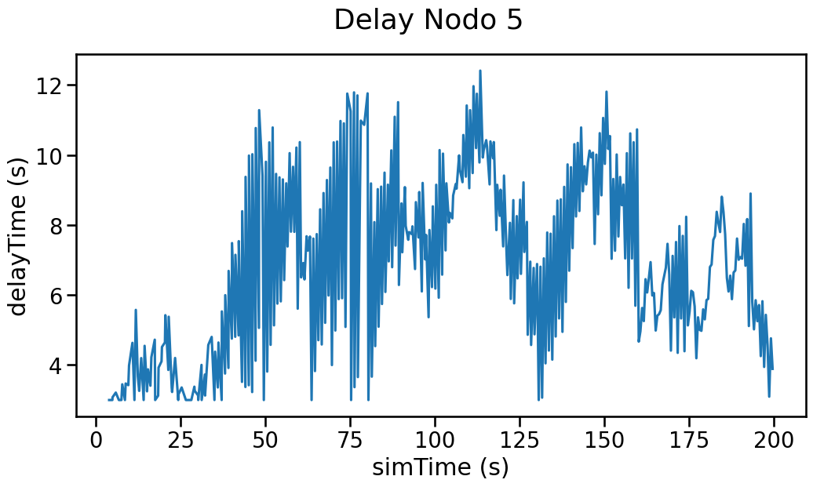


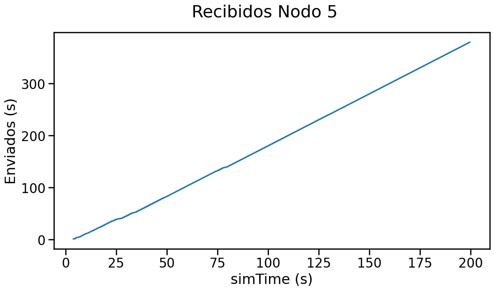


### Caso 2
Al igual que en la primera parte, se altera la red para que todos los nodos a excepción del 5 generen paquetes.
La cantidad generada por los mismos se puede ver de manera combinada en el siguiente gráfico.

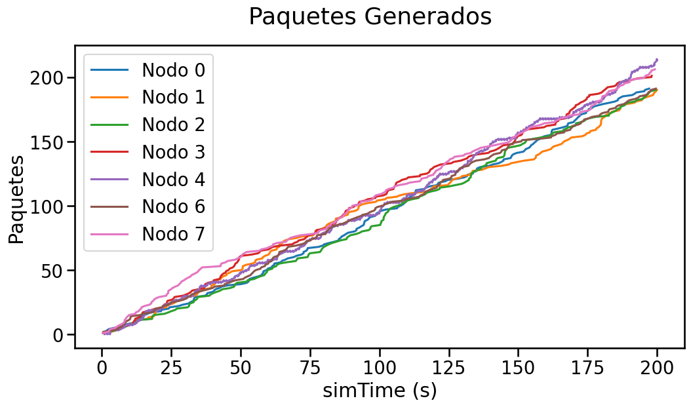

El siguiente gráfico muestra en qué medida se llenan los bufferes de los nodos. Se puede ver fácilmente que los bufferes que más se llenan son aquellos cercanos al nodo destino, ya que son aquellos por los cuales se tiene mayor tráfico de paquetes desde los nodos más lejanos.

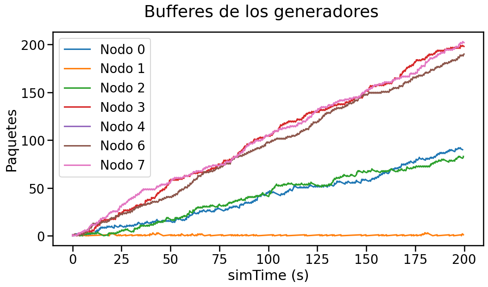

En el siguiente gráfico se puede observar el retardo de entrega de paquetes por parte del nodo 5, cuyo análisis haremos más adelante.

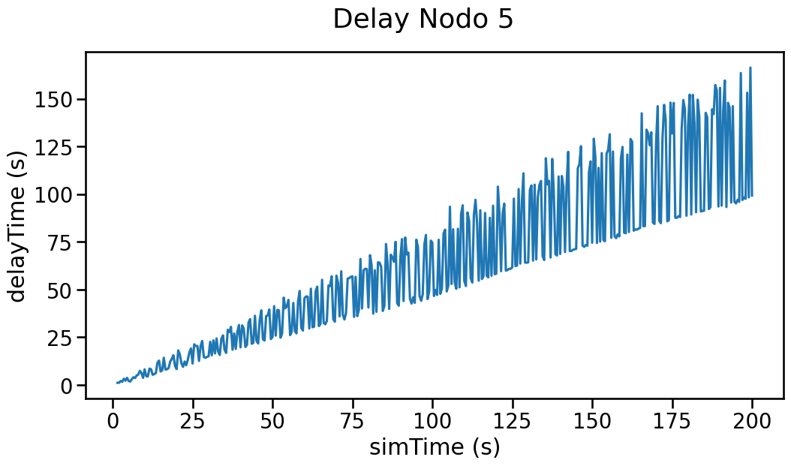

El gráfico a continuación expresa la cantida de paquetes que el nodo 5 envía a la capa de aplicación.

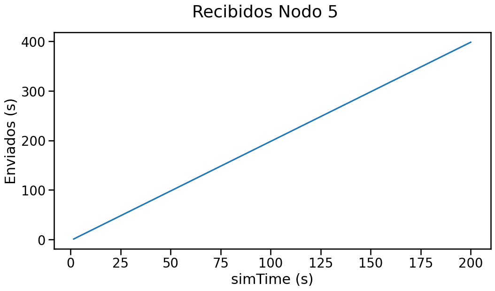


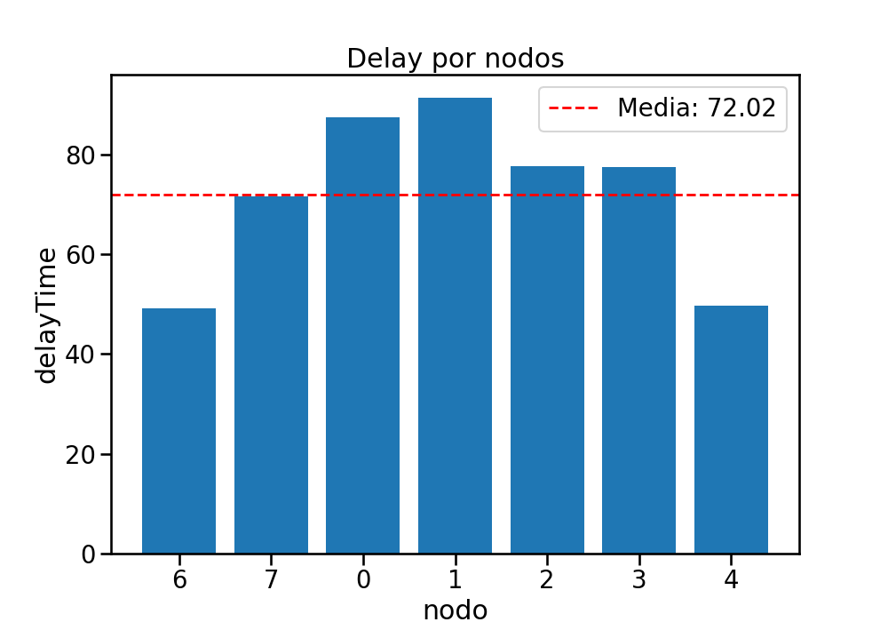

Aquí podemos observar que el delay ha disminuido bastante, ahora la media es de 72.

Una vez obtenidas las nuevas métricas, vamos a realizar una comparación entre las mediciones de ambas partes.
La diferencia más importante y notable se dio en el retardo de entrega de los paquetes, es por eso que la trataremos primero. 

La primera diferencia observable es que se producen más variaciones en la misma unidad de tiempo (el doble, para ser precisos) en la función del delay. Esto ocurre porque, como puede verse en el gráfico de paquetes recibidos por App desde el nodo 5, se enviaron el doble de paquetes que en la parte 1. Usando el algoritmo se enviaron 400 paquetes aproximadamente, mientras que sin el algoritmo se enviaron 200, lo que afecta notoriamente la cantidad de veces que se registran retardos de paquetes provenientes de los generadores. Esta diferencia se ve reflejada en el gráfico de la función delay, que en la parte 2 cuenta con variaciones mucho más rápidas que en la parte anterior.
Vemos entonces una mejora en la eficiencia del 100% en la cantidad de paquetes enviados, ya que el nodo 5 recibe paquetes desde ambas direcciones y envía un 100% de paquetes en los 200 segundos que dura la simulación. Además, redujimos la media del retardo de paquetes entre todos los nodos en un 20%, ya que ahora los paquetes siempre recorren la ruta óptima hacia el nodo 5.

La segunda mejoría importante, que en parte ya fue tratada en el ítem anterior, es la cantidad de paquetes enviados a la capa de aplicación a través del nodo 5, que presenta un incremento del 100% con respecto a la parte 1, y que a su vez implica una reducción notable en la pérdida.
Si bien la red sigue presentando una tasa de pérdida muy grande (se pierden alrededor de 1000 paquetes de los ~1400 generados), del 60% para ser más precisos, logramos reducirla en aproximadamente un 20% con respecto a la parte 1 (que presentaba una pérdida promedio del 83%). Lograr reducciones más importantes en la tasa de pérdida de paquetes en una red anillo como esta elevaría tanto la complejidad que quizás no valdría la pena desde el punto de vista de la carga en la red.


# Conclusion

Luego de un análisis de una red con topología de anillo, llevamos a cabo la implementación presentada del algoritmo para eficientizar así el retardo que los paquetes presentaban entre su generación y su envío con el algoritmo original. Como se detalla en la sección "Rendimiento", este algoritmo logró los objetivos propuestos.

## Trabajo posterior / mejoras

Una posible mejora sería tener paquetes de confirmación para poder informar que el paquete llegó bien. Además en este paquete se podrían agregar campos para controlar la congestión. Esto permitiría que el algoritmo tenga un comportamiento más robusto ante desconexiones.
Otra posible mejora sería la incorporación de una etapa de mapeo de red más profunda que nos permita trabajar con topologías más diversas, ya que el algoritmo presentado se aprovecha fuertemente de la disposición en anillo para determinar la ruta óptima.

---
# Anexo

## Inteligencia artificial

Ahora que tenemos mas conocimiento de Omnet++ no ha sido necesario consultarle a ChatGPT sobre problemáticas referidas a este framework. En caso de requerir más información respecto a la implementación y funcionamiento de algún elemento, hemos usado documentación oficial de Omnet o ejemplos en la web de su uso. 
Sin embargo, para tareas sencillas y repetitivas como la carga de información de los vectores hemos utilizado Copilot de GitHub para autocompletar este tedioso proceso.

Otro uso de la IA fue ChatGPT cuando precisabamos información sobre el funcionamiento de Matplotlib para la confección de gráficos con Python. Un ejemplo de uso puede verse a continuación:  

```
Delay 0: 76.924
Delay 1: 107.395
Delay 2: 94.8056
Delay 3: 110.671
Delay 4: 132.766
Delay 6: 46.0864
Delay 7: 68.0947

Hola, puedes hacerme un gráfico de barras en matplotlib con estos datos? Gracias
```

**Respuesta**: efectiva, nos dio el gráfico de barras como le pedimos.

```
se puede poner la media de los datos en el grafico de barras?
```

**Respuesta:** efectiva, hizo uso de numpy y agregó con líneas punteadas la media en el gráfico de barras.


